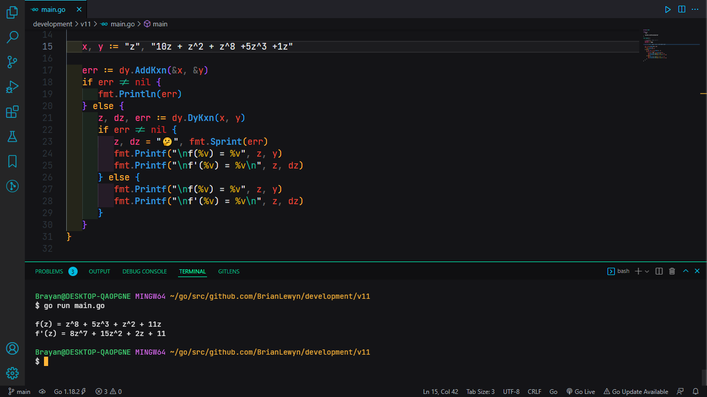

# brianlewyn/dxix


The `brianlewyn/dxix` package is intended for programmers who have to work with math derivatives.

That is why this package provides functions that allow us to calculate derivatives of one or more mathematical expressions in an easier and more organized way.

The goal is that from a text string that contains math expressions with or without literals, the functions of the package are able to return the result with the same data type.


---

* [Install](#install)
* [dxix.AddKxn()](#dzaddkxn)
* [dxix.DdKxn()](#dzdykxn)
* [License](#license)

---


## Install

With a [correctly configured](https://golang.org/doc/install#testing) Go toolchain:

```sh
go get -u github.com/brianlewyn/dxix

```


## dxix.AddKxn()

* Sums all expressions `kx^n` as long as this has the same literal `x` and exponent `n`.
* The independent variable `x` (or any other) must be defined as lowercase or uppercase, since this modifies the expression to be of the same type..
* There is no limit to the number of expressions to calculate.
* Integer or float values can be entered for both the constant `k` and the exponent `n`.
* If you use floats, the value will be accurate to two decimal places, but this can be changed.
* You can work with any literal with as many letters as you like.
* Sort the expressions `kx^n` from highest to lowest exponent.
* The positive and negative signs are taken into account when adding.
* Between each math expression you can put a space `x +x` or a space, a sign and another space `x + x`.
* If at the beginning of the string, an expression is negative, the minus sign is placed as it is. But if it is positive, the sign, the sign and a space can be put, or simply nothing.
* No matter how you enter kx^n, as long as it is an expression, the program will take care of inferring and reconstructing the expressions to their base form to perform the correct operation.
* All math expressions that have constant 1, exponent 1 or 0, will be represented in their most compact and clear form.


## dxix.DdKxn()

* Keeps all the previous features.
* For each expression execute the rule of the derivative of `kx^n`.
* In the possible case that defines the literal in uppercase and all expressions in lowercase or vice versa, the program will always put all literals in lowercase. 
* **Note: Only if all expressions were written with exactly the same literal, otherwise an error is thrown as if there was a constant literal.**


## Example: AddKxn() & DdKxn()

```go
package main

import "fmt"
import "github.com/brianlewyn/dxix"

func main() {
   
   // dxix.DFrmt = 102 // ← `f`
	// dxix.NPrec = 2
	// dxix.Zero = ".00"

   x, y := "z", "10z + z^2 + z^8 +5z^3 +1z"

   err := dxix.AddKxn(&x, &y)
	if err != nil {
		fmt.Println(err)
	} else {
		z, dz, err := dxix.DdKxn(x, y)
		if err != nil {
			z, dz = "🤔", fmt.Sprint(err)
			fmt.Printf("\nf(%v) = %v", z, y)
			fmt.Printf("\nf'(%v) = %v\n", z, dz)
		} else {
			fmt.Printf("\nf(%v) = %v", z, y)
			fmt.Printf("\nf'(%v) = %v\n", z, dz)
		}
	}
}
```


In the following image, we are shown that when executing the file, the result is as expected.



As shown in the example above, the program is capable of performing calculations in various situations. It should be noted that if more precision is needed on the decimals, this can be changed with the variables `dxix.DFrmt`, `dxix.NPrec` and `dxix.Zero`.


## License

GNU licensed. See the LICENSE file for details.
